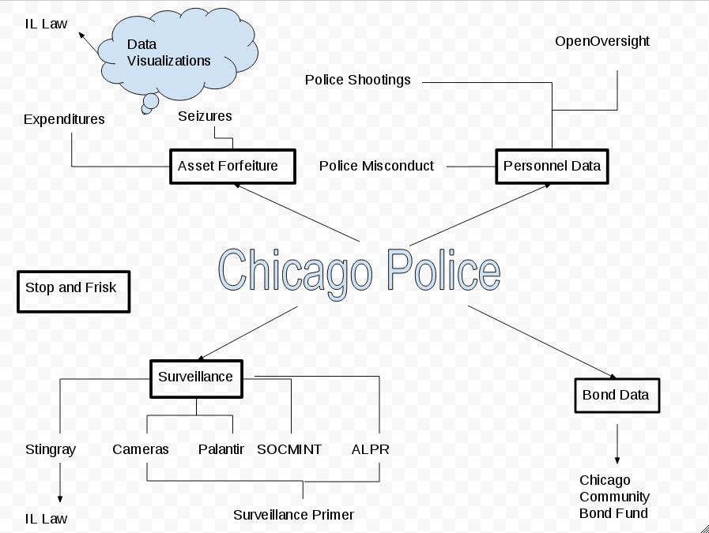

# FOIA The Police

**foiathepolice.com** will be an interactive webpage that is hosted as a project by the [Lucy Parsons Labs](https://lucyparsonslabs.com/). The goal of FOIA The Police (FTP)  will be to: 

 1. Create a historical archive of LPL FOIA requests and documents
 2. Teach the public the (occasionally) esoteric tips and tricks that were used to obtain data
 3. Show the public how FOIA can inform other creative projects
 4. Highlight how FOIA can inform journalism, legislation, and drive reform.

# High Level Overview

First we will break down different topics of policing that the public might be interesting in FOIAing. **NOTE:** Each line represents a different request _and_
a different tip or trick used when we sent the FOIA. While they may be subsets of the same topic, each request is unique. 

# Design

Ideally this would implemeneted as interactive webapp which would also host PDFs. The current design is a work in progress.

# Historical Archive

The purpose of a historical archive is to allow the public to view all of our documents, _how_ we obtained them, _how_ we framed the FOIA request and any specific tips or tricks we needed to complete the project. As an example, our front-page story in the [Chicago Reader](https://www.chicagoreader.com/chicago/chicago-police-department-civil-forfeiture-investigation/Content?oid=23728922) was completed over a year and a half. The [story](https://www.chicagoreader.com/Bleader/archives/2016/09/29/how-we-pulled-back-the-curtain-on-cpds-secret-spending) about _how_ we obtained the documents might help others facing similar data challenges. Another purpose of the historical archive is to share our data with others, because sometimes agencies will refuse to release records that they [had previously released](https://www.muckrock.com/news/archives/2017/apr/26/chicago-police-cellebrite/). 

# Tips and Tricks

Each request might have a different history and used a different technique. We hope that FTP will highlight some of the unique tips including:
 
 * Writing an SQL query and submitting that as a FOIA request
 * Grabbing purchase orders for equipment then doing a FOIA for its use
 * FOIAing a commander's emails for controversial equipments that they would oversee implementation of
 * "Daisy Chain" documents from one request to request another set of records

The point of this will be to teach the public how to use FOIA and raise the knowledge base of the public. 

# Creative Projects

Often, the Lucy Parsons Labs gets approached by other groups to help them find data they know exists but don't know how to obtain (see above). However, data can be used to inform many other types of projects. For example, with officer personnel data, you can [identify officers who shot and kill](https://lucyparsonslabs.com/projects/shootings/), or expand that data into other projects like [OpenOversight](https://openoversight.com). We hope that by showing _how_ we are working with data, it will inspire others to think creatively about new projects. 

